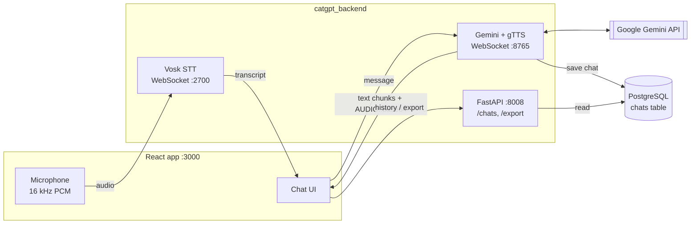

# CatGPT: Voice Conversation System for a Robot Cat

The conversational software behind an interactive robot cat. You speak to the cat, it transcribes your speech offline, replies in the voice of a curious child learning English, and reads the reply aloud. Every conversation is logged so it can be reviewed or exported.

## Why

The cat is designed as an English-practice partner: the user plays the teacher and the cat behaves like a student who asks questions and responds naturally. This gives learners a low-pressure way to practise speaking.

## Features

- **Hands-free voice input:** browser microphone audio is streamed to an offline Vosk speech recognizer; the message is sent automatically when you stop speaking (silence detection) or when you stop recording.
- **Streaming AI replies:** Gemini 2.5 Flash-Lite generates the reply, streamed to the UI word by word.
- **Sentence-by-sentence speech:** each completed sentence is converted to audio with gTTS and played while the rest of the reply is still generating.
- **Text input** as an alternative to speaking.
- **Conversation log** stored in PostgreSQL, viewable as a table in the UI.
- **Export** the log as CSV (UI) or as CSV/PDF (API).
- **One-command deployment** with Docker Compose.

## Architecture



FastAPI starts both WebSocket servers on startup, so the backend runs as a single process.

## Tech stack

| Layer | Technologies |
| --- | --- |
| Speech-to-text | Vosk (`vosk-model-small-en-us-0.15`, offline) |
| Language model | Google Gemini 2.5 Flash-Lite (`google-generativeai`) |
| Text-to-speech | gTTS |
| Backend | Python 3.12, FastAPI, `websockets`, `databases` + asyncpg, ReportLab |
| Database | PostgreSQL 13 |
| Frontend | React 18 (Create React App), Web Audio API, served by nginx |
| Deployment | Docker, Docker Compose |

## Project structure

```
NoeNoe_Cat/
├── docker-compose.yaml          # backend, frontend, postgresql
├── .env.example                 # GEMINI_API_KEY
├── backend/
│   ├── app.py                   # FastAPI app; starts both WebSocket servers
│   ├── gemini_websocket.py      # Gemini streaming + gTTS audio
│   ├── vosk_websocket.py        # Streaming speech recognition
│   ├── database.py              # Connection and table setup
│   ├── queries/chats.py         # Insert / fetch chats
│   ├── routes/                  # /chats and /export endpoints
│   ├── utils/export.py          # CSV and PDF generation
│   └── models/                  # Vosk English model
└── frontend/src/
    ├── App.js
    ├── components/              # Header, MessageList, InputControls, ChatHistoryTable
    ├── hooks/                   # useVoskWebSocket, useGeminiWebSocket
    └── utils/                   # Audio playback, export helpers
```

## Getting started

You need Docker Desktop and a Gemini API key from [Google AI Studio](https://aistudio.google.com/apikey).

```bash
git clone https://github.com/NoeNoe25/NoeNoe_Cat.git
cd NoeNoe_Cat
cp .env.example .env            # then put your key in .env
docker compose up --build
```

Then open http://localhost:3000 and allow microphone access.

| Service | URL |
| --- | --- |
| Web app | http://localhost:3000 |
| REST API docs | http://localhost:8008/docs |
| Speech-to-text WebSocket | ws://localhost:2700 |
| Gemini WebSocket | ws://localhost:8765 |

### API

| Method | Endpoint | Description |
| --- | --- | --- |
| GET | `/chats?limit=50` | Most recent conversations (max 1000) |
| GET | `/export/chats-csv` | Download the log as CSV |
| GET | `/export/chats-pdf` | Download the log as PDF |

### Configuration

| Variable | Default | Used by |
| --- | --- | --- |
| `GEMINI_API_KEY` | none (required) | backend |
| `POSTGRES_USER` / `POSTGRES_PASSWORD` / `POSTGRES_DB` | `username` / `password` / `catgpt` | backend (must match the `postgresql` service in `docker-compose.yaml`) |
| `POSTGRES_HOST` / `POSTGRES_PORT` | `postgresql` / `5432` | backend |

The default database credentials are for local development only.

## Screenshots and demo

_To add:_ a screenshot of the chat UI during a conversation, the chat-history table, and a short video of the robot cat responding by voice.

## Limitations

- The WebSocket URLs in the frontend are hard-coded to `localhost`, so the app works only on the machine running the backend.
- Speech recognition and TTS are English only.
- The Vosk small model favours speed over accuracy.
- The hardware side of the robot is not part of this repository.

## Future improvements

- Configure backend URLs through environment variables for remote deployment
- Add conversation difficulty levels for different learner ages
- Run TTS offline to remove the gTTS network dependency

## Team

- **Hsu Myat Noe** · [GitHub](https://github.com/NoeNoe25) · [LinkedIn](https://www.linkedin.com/in/hsu-myat-noe569aa729a/)
- **Su Sandi Linn** · [GitHub](https://github.com/SuSandiLinn13)
- **Hein Htet Soe** · [GitHub](https://github.com/HeinHtetSoe-RAI7)
